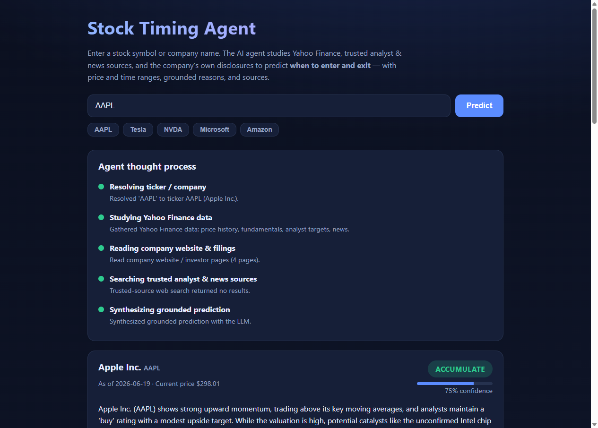

# Stock Predictor — AI timing agent

> ### 🚀 Live demo — [**jalagam-stockpredictor.hf.space**](https://jalagam-stockpredictor.hf.space/)
> **Try it now, no setup required.** Just enter a ticker (e.g. `AAPL`) or a company
> name and watch the agent work. *(Free hosting — the first request after it's been
> idle may take ~30–60s to wake up.)*

An AI agent that takes a **stock ticker or company name** and predicts **when to
buy and sell** — with concrete **price ranges**, **time windows**, strong
grounded reasons, the agent's thought process, and the **sources** it used.

The agent grounds every prediction on:

1. **Yahoo Finance** — price history, fundamentals, analyst price targets, news.
2. **Trusted web sources only** — analyst ratings & news, filtered to an
   allowlist (Reuters, Bloomberg, WSJ, FT, CNBC, SEC, Nasdaq, Morningstar, …).
3. **The company's own website** — investor-relations / press / latest results.

It then synthesizes an **entry plan** and **exit plan** (price + time range)
with a recommendation, confidence, strong reasons, and risks.

> ⚠️ Educational AI analysis — **not financial advice**.

---

## Screenshot



---

## Architecture

Two **independent services** (so the agent can be swapped later):

```
┌─────────────────┐        /api (reverse proxy)        ┌──────────────────────────┐
│   ui (React)    │  ───────────────────────────────▶  │   agent (FastAPI +        │
│  nginx :80      │        Server-Sent Events           │   LangGraph) :8000        │
└─────────────────┘                                     └──────────────────────────┘
                                                          │  Yahoo Finance (yfinance)
                                                          │  Trusted web search
                                                          │  Company website scan
                                                          └─ LLM (OpenAI-compatible)
```

- **`agent/`** — Python, [LangGraph](https://langchain-ai.github.io/langgraph/)
  workflow exposed via FastAPI. Streams progress over SSE.
- **`ui/`** — React + Vite + TypeScript, served by nginx, which reverse-proxies
  `/api` to the agent. The agent host is configurable (`AGENT_HOST`/`AGENT_PORT`)
  so you can point the UI at a different agent implementation without rebuilding.

### LangGraph flow

```
resolve ─▶ yahoo ─┬─▶ web ─────┐
                  └─▶ company ──┴─▶ predict
```

`resolve` (ticker/company) → `yahoo` (market data) → fan-out to `web`
(trusted analyst/news search) and `company` (IR/press scan) → `predict`
(LLM synthesizes a grounded buy/sell timing plan with structured output).

---

## Quick start

### 1. Configure

```bash
make env          # or: ./make.ps1 env   (Windows)
# then edit .env and set OPENAI_API_KEY (and optionally TAVILY_API_KEY)
```

| Variable           | Required | Description                                                |
| ------------------ | -------- | ---------------------------------------------------------- |
| `OPENAI_API_KEY`   | yes      | LLM key (OpenAI or any OpenAI-compatible endpoint).        |
| `OPENAI_MODEL`     | no       | Default `gpt-4o-mini`.                                      |
| `OPENAI_BASE_URL`  | no       | Point at Azure / local / proxy OpenAI-compatible endpoint. |
| `TAVILY_API_KEY`   | no       | Better grounded search. Falls back to DuckDuckGo if unset. |
| `TRUSTED_DOMAINS`  | no       | Comma-separated allowlist of trusted sources.              |

### 2. Run

```bash
make up           # or: ./make.ps1 up   (Windows)
```

- UI:    http://localhost:3000
- Agent: http://localhost:8000/health

---

## Build & deployment (Makefile / make.ps1)

| Target         | What it does                                                  |
| -------------- | ------------------------------------------------------------- |
| `env`          | Create `.env` from `.env.example`.                            |
| `install-hooks`| Install git hooks that keep API keys out of commits.          |
| `clean`        | Remove build artifacts, caches, stop & remove containers.     |
| `build`        | Build both service Docker images.                             |
| `containerize` | Alias for `build` (produce container images).                 |
| `package`      | Save built images as tarballs into `build/`.                  |
| `up`           | Build (if needed) and start both services (docker compose).   |
| `down`         | Stop and remove services.                                     |
| `restart`      | Restart the stack.                                            |
| `rebuild`      | No-cache rebuild and restart.                                 |
| `logs` / `ps`  | Follow logs / list services.                                  |
| `health`       | Curl the agent health endpoint.                               |

**Linux/macOS/WSL/CI:** use `make <target>`.
**Windows PowerShell:** use `./make.ps1 <target>`.

Full pipeline example:

```bash
make clean && make build && make package && make up
```

---

## API

- `GET  /health` — service status (LLM/search configuration).
- `POST /api/predict` — body `{ "query": "AAPL" }` → full `PredictResponse`.
- `GET  /api/predict/stream?query=AAPL` — SSE stream of `step` events and a final
  `result` event (used by the UI to show the live thought process).

---

## Swapping the agent later

Because the UI only talks to `/api` (reverse-proxied by nginx), you can replace
the agent service with any implementation exposing the same endpoints. Either
point `AGENT_HOST`/`AGENT_PORT` (UI service env) at the new service, or swap the
`agent` service in `docker-compose.yml`. No UI rebuild required.

---

## Secrets & git hooks

`.env` is git-ignored, but a **pre-commit hook** (`.githooks/pre-commit`) adds a
safety net so API keys never land in history:

- If a `.env` file is ever staged, the hook **redacts secret values from the
  staged copy only** — your local `.env` keeps its real keys.
- If an API-key-shaped token (OpenAI `sk-…`, Perplexity `pplx-…`, Tavily
  `tvly-…`, AWS, Google, GitHub, Slack) appears in any other staged file, the
  commit is **blocked**.

Install it (one-time, per clone):

```bash
make install-hooks        # or: ./make.ps1 install-hooks   (Windows)
```

This copies hooks into `.git/hooks` (no git config changes). Bypass in an
emergency with `git commit --no-verify` (not recommended).

## Notes & limitations

- Predictions are **AI-generated and educational**, not financial advice.
- Web/Yahoo data availability varies; if sources are thin, the agent lowers its
  confidence and lists the gaps as risks.
- Without `OPENAI_API_KEY`, the agent still gathers data but returns a
  data-only response explaining that the LLM is not configured.
